# John Freier

Technical founder and full-stack architect. Two companies built from scratch — one that scaled, one that didn't survive COVID. Currently running a 45+ service homelab as an AI-native operations proving ground, building multi-agent orchestration tooling, and writing about the things I've learned (mostly the hard way).

## The Numbers That Matter

| Metric | Value |
|--------|-------|
| Companies founded | 2 |
| Funding raised | $2M (Pangeam, at $15M valuation) |
| Cloud cost reduction | $240k/year (Statricks, cloud to bare-metal migration) |
| Infrastructure scale | 45+ Docker services, 20+ TB storage, 40+ PostgreSQL databases |
| Current lab cost | ~$150-200/month |

## Experience

<strong>Statricks</strong> — Co-founder, Technical Lead

Built a classified ads analytics platform from zero to production on bare-metal infrastructure.

- Designed and operated multi-TB PostgreSQL HA clusters on bare-metal servers
- Built ensemble ML pipeline for classified ad categorization and pricing
- Led cloud-to-bare-metal migration that cut infrastructure costs by $240k/year
- Maintained zero unplanned downtime for 18 consecutive months
- Full ownership: architecture, deployment, monitoring, on-call

<strong>Pangeam</strong> — Co-founder, Technical Lead

Built computer vision and ML systems for enterprise facility management. Raised $2M at a $15M valuation.

- Deployed on-prem CV/ML systems in 2 Fortune 50 headquarters
- Integrated 50+ LIDAR sensors for real-time occupancy tracking
- Navigated enterprise procurement cycles and security reviews
- COVID killed the in-office occupancy market. We returned ~$400k to investors and shut down cleanly
- The technology worked. The timing didn't.

## Current Build

Running a homelab as an AI-native ops environment — not as a toy, but as a real proving ground for how AI agents can operate infrastructure.

- **45+ Docker Swarm services** on consumer hardware (RTX GPUs for local ML inference)
- **Claude Code as operator** — using MCP protocol to give AI agents direct infrastructure access
- **ZFS snapshots** as an AI safety mechanism (rollback when agents break things)
- **Building initiative-engine** — a multi-agent orchestration platform that turns conversations into parallel workstreams

<strong>Stack</strong>

**Languages:** Python, TypeScript, SQL, Bash

**Frontend:** React, Next.js, Tailwind CSS

**Backend:** FastAPI, Hono, Node.js

**Data:** PostgreSQL, Redis, Elasticsearch, Milvus (vector DB), Neo4j

**Infrastructure:** Docker Swarm, ZFS, Traefik, Nginx, Prometheus, Grafana

**AI/ML:** Claude Code, MCP protocol, LiteLLM, local inference (Ollama)

**Tools:** uv, pnpm, Git, SonarQube, Ansible

## Writing

Blog coming at [blog.johnefreier.com](https://blog.johnefreier.com) — retrospectives on startup failures, homelab architecture decisions, and building with AI agents.

## What I'm Working On

- **initiative-engine**: Multi-agent orchestration platform with 10+ specialized AI agents
- **Homelab AI ops**: Giving Claude Code direct infrastructure access via MCP servers
- **Writing**: Honest retrospectives on what worked, what didn't, and why

## Contact

[jefreier@berkeley.edu](mailto:jefreier@berkeley.edu) · [LinkedIn](https://linkedin.com/in/johnfreier) · [X](https://x.com/johnf_ucb)

---

<picture>
  <source media="(prefers-color-scheme: dark)" srcset="assets/terminal-dark.svg" />
  <source media="(prefers-color-scheme: light)" srcset="assets/terminal.svg" />
  
</picture>

<picture>
  <source media="(prefers-color-scheme: dark)" srcset="https://raw.githubusercontent.com/gofullthrottle/gofullthrottle/output/github-contribution-grid-snake-dark.svg" />
  <source media="(prefers-color-scheme: light)" srcset="https://raw.githubusercontent.com/gofullthrottle/gofullthrottle/output/github-contribution-grid-snake.svg" />
  
</picture>
